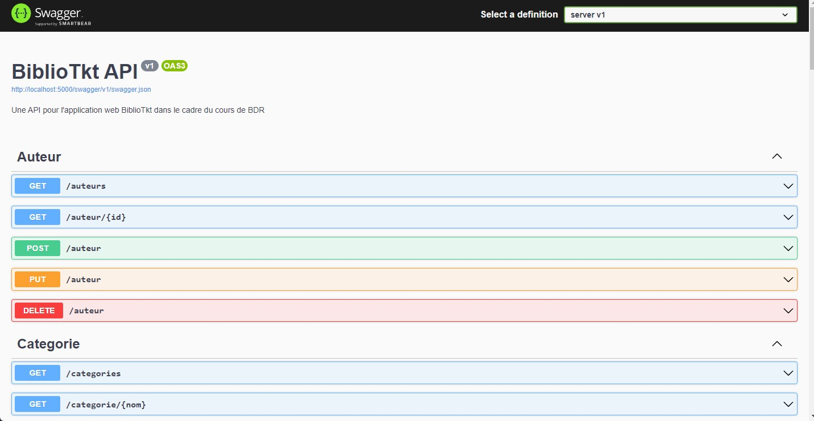

# Bibliotkt

Ce projet, réalisé dans le cadre du cours de base de données relationnelles, se porte sur une application web permettant la gestion d’une bibliothèque. Il s’agit d’une application qui affiche le catalogue de la bibliothèque et permet d’y effectuer des recherches. Elle donne aussi des outils de gestion aux employés comme la possibilité de modifier le catalogue de livres ou faire des emprunts pour les membres de la bibliothèque.

L'application est séparée en deux sous-applications, une API écrite en C# avec le framework .NET 6 et une interface web en Javascript compilée avec Node.js.
## Marche à suivre d'installation:

### Prérequis: 

- [SDK .NET 6.0](https://dotnet.microsoft.com/en-us/download/dotnet/6.0)
- [Node.js 16 LTS](https://nodejs.org/en/)
- PostgreSQL 14

### Vérifications du setup initial:

Les installations sont simples et ne demandent pas de cocher des options spécifiques. Pour être sûr que les deux applications puissent se lancer, voici des commandes pour vérifier les versions installées :


#### Backend :

```bash
> dotnet --version
6.0.101
```


#### Frontend :

```bash
> node -v
16.13.1

> npm -v
8.1.2 
```

### Compilation et lancement des applications

#### Backend :

Depuis un terminal, se rendre à la racine du dossier `server` et lancer la commande suivante :

```bash
# Création des .dll et fichiers de production
> dotnet publish -c Release -o out

# Se rendre dans le dossier généré
> cd out

# Lancement du programme
> dotnet server.dll
```

L'API est maintenant prête à écouter les requêtes HTTP du frontend sur l'url http://localhost:5000.

Elle met aussi à disposition une interface graphique mappant tous ses endpoints disponibles via Swagger. Son url est la suivante : http://localhost:5000/swagger/index.html



#### Frontend :

Depuis un terminal, se rendre à la racine du dossier `client` et lancer la commande suivante :

```bash

# Installation des dépendances
> npm install

# Création des fichiers de productions
> npm run build

# Lancement du serveur web
> npm run preview
```

Le site est maintenant disponible sur l'url http://localhost:3000
